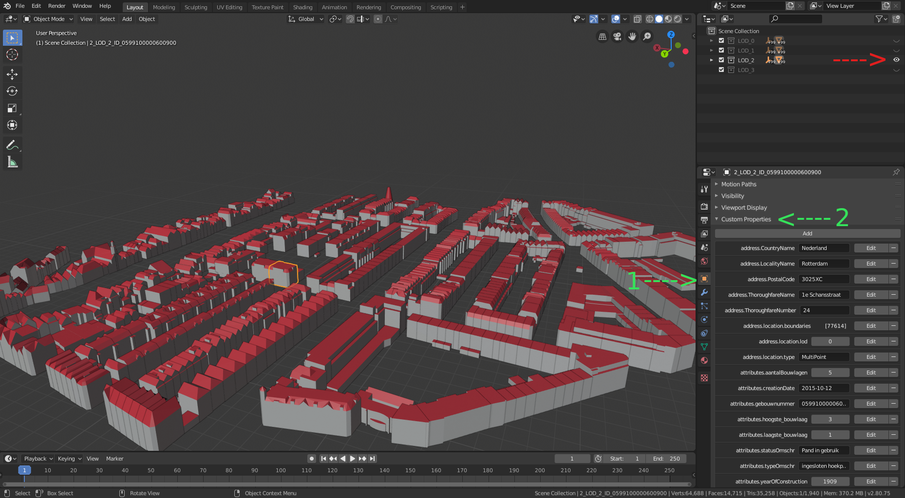
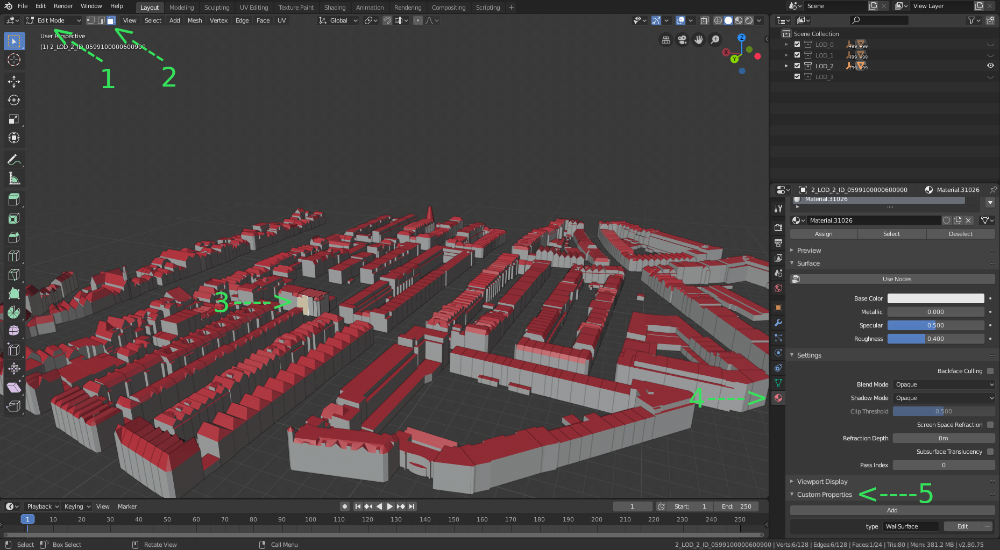

# Blender-CityJSON-Plugin

A Blender plugin to import 3D city models encoded in the [CityJSON](http://cityjson.org) format.

## Requirements

- Blender Version >=2.80

## How to install and use the parser

1. Download the `CityJSON_Blender_parser.py` add-on, and install it locally to Blender. Menu `Edit > Preferences >Add-ons`, and `Install`. 

2. Make sure the add-on is enabled (by default it is disabled).

3. Go to `File > Import > CityJSON` and navigate to the directory where the CityJSON file is stored and open it.

4. If you want to visualize a certain area, click `Shift + B` and draw a rectangle with your mouse to zoom in into that specific area of the dataset.

5. To select all the children of a building right click on the building's (parent's) ID and click `Select Hierarchy`

6. To see the properties of each object simply select the object and click on the `Context.Object` tab on the bottom right (Blender 2.80 interface). Then click the `Custom Properties` drop down menu. (See the screenshot below!)

7. To see the semantics of each surface select an object in `Object Mode` then hit `TAB` to enter `Edit Mode` and click `Face Select` (top left of the viewport next to the `View` button). Then click on the `Context.Material` tab at the bottom right. Then scroll down and click on the `Custom Properties`. (See the screenshot below!)

8. In case more than one geometries exist for the objects, for every geometry a new `Scene` is created and the objects represented in that geometry are rendered into that `Scene`. You can alternate among different `Scenes` by clicking on the scene browser on the top right of the interface. (See the screenshot below!) 

 

## Development

Clone this repository and have fun!

If you are using Visual Studio Code, you may:

- Install [Blender Development](jacqueslucke.blender-development
): a plugin that allows starting and debugging Python scripts from VSC.
- Install the [fake-bpy-module](https://github.com/nutti/fake-bpy-module) to enable auto-completion: `pip install fake-bpy-module-2.80`.
