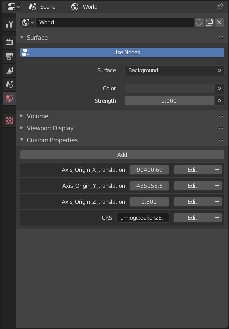
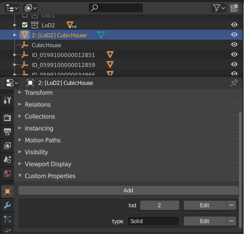
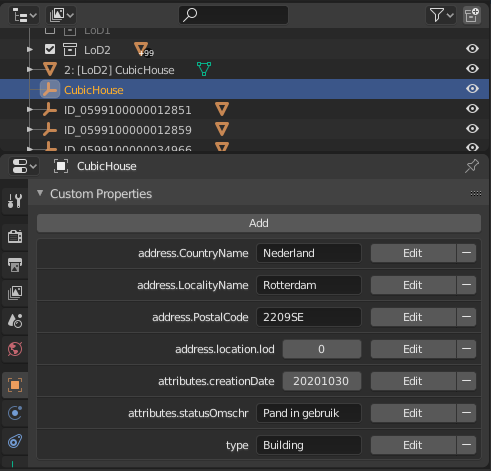

*This add-on was originally developed by Konstantinos Mastorakis ([konmast3r](https://github.com/konmast3r/)) as part of their research orientation project for the MSc Geomatics programme of TU Delft. Its functionality was further developed for the needs of their MSc thesis [An integrative workflow for 3D city model versioning](http://resolver.tudelft.nl/uuid:a7f7f0c8-7a34-454e-973a-d55f5b8b0dfe)*

I plan to keep developing this add-on as a free-time project since I enjoy it a lot and because I see that there are many enthusiasts out there already using it in ways more serious than I expected. Although I am very excited to see that, I can't guarantee how much and how often `Up3date` going to be further developed.

# Up3date

A Blender add-on to import, edit and export new instances of [CityJSON](http://cityjson.org)-encoded 3D city models. All buildings' levels of detail (LoD), attributes and semantic surfaces are stored and can be accesed via Blender's graphical interface.

## Requirements

- Blender Version >=2.80

## Testing Datasets

You can find sample datasets at the official [CityJSON](https://www.cityjson.org/datasets/#datasets-converted-from-citygml) website. In case you have 3D city model datasets encoded in `CityGML` you can use the free [Conversion Tool](https://www.cityjson.org/help/users/conversion/) to convert to and from `CityGML` and `CityJSON` and vice versa.

Trying to import really big datasets such as `New York` will take several minutes because of the amount of information contained. With the rest sample `CityJSON` files everything should work noticeably faster. Depending on your machine, it could take some seconds up to few minutes minute to import the 3D city model. 

## Installation

1. Download this repository as zip (through GitHub this can be done through the `Clone or download` > `Download ZIP` button).

2. Run `Blender` and go to `Edit > Preferences > Add-ons` and press the `Install...` button.

3. Select the downloaded ZIP and press `Install Add-on from File...`.

4. Enable the add-on from the list, by ticking the empty box next to the add-on's name. 
*(Optional: If you wish to update to a newer version, un-tick and tick again the add-on to reload it!)*

## Usage

### Before you start!

- For better understanding of the logic behind the add-on it is **strongly** recommended to have a quick (or thorough :-)) look on the [CityJSON documentation](https://www.cityjson.org/specs/1.0.1/#city-object) if you are unfamiliar with it.

- In case you run `Blender` through the console, useful feedback is given in it, informing about the progress of the import and export process. Upon importing and exporting from `Blender` it might prove quite useful since in the case of big files it can take up to several minutes. It will also print an error message in case of a crash, which is quite useful for debugging purposes.* 
**\*Important: Make sure `Blender's` viewport is in `Object Mode` before importing and exporting a CityJSON file.**

### Importing a 3D city model

Go to `File > Import > CityJSON (.json)` and navigate to the directory where the `CityJSON` file is stored and open it.

#### Options

The following options are available during file selection:

* `Materials' type`:
    * `Surfaces` will create materials according to semantic surfaces *(e.g. RoofSurface, WallSurface)*, if present, and load their attributes.
    * ` City Objects` will create materials per city object and according to the city object's type *(e.g. Building, Road)*.
* `Reuse materials`: Enable this if you want semantic surface materials to be reused when they share the same type. For example, all `RoofSurface` faces will have the same materials. *This only work when `Surfaces` are selected as `Materials' type`*.  
**\*Important: Greatly improves speed of loading, but semantic surfaces' attributes can be lost, if present!** 
* `Clean scene`: Enable this if you want the script to clean the scene of any existing object prior to importing the `CityJSON` objects.

#### Useful tips

- After a successful import, you should be able to see the model somewhere close to the axis origin. Rotation of the scene and zooming in and out might help you, locating the model. 
In case you can't see the model, select an object from the `Outliner`* (always in `Object Mode`) and click `View > Frame Selected` or use the `home` button of your keyboard right after importing and try zooming in.  
**\*Important: Make sure the object you are selecting is a `mesh object` and not an `empty object`. You can check that from the small pointing down triangle icon next to the object's name.** 

- A different `Collection` is created for each `LoD` present in the 3D city model. In case more than 1 geometry exists for the objects -representing different `LODs` (levels of detail)-, every geometry is stored under the appropriate `Collection`, under the parent `CityObject`. You can display different `Collections` by clicking on the `eye icon` in the `Outliner` at the top right of the interface (see screenshot below). By default all the `LOD_x` collections should be visible right after importing the 3D city model. In case you see any artefacts that is the reason! Choosing only one visible collection should remove all artifacts. 

- In case you want to visualize a certain area, click `Shift + B` and draw a rectangle with your mouse to zoom into that specific area of the 3D city model. This also moves the rotation center at that point, which will come handy when you want to inspect specific areas of the model.

- To see the attributes of each object, simply select the object on the screen and click on the `Object Properties` tab on the bottom right of `Blender's` interface. Then click `Custom Properties` drop down menu (see screenshot below).

- To see the semantics of each surface, select an object in `Object Mode`, hit `TAB` to toggle `Edit Mode` and click `Face Select` (top left of the viewport between the `Edit Mode` and the `View` button). Select a face of the object and click on the `Material Properties` tab at the bottom right. Scroll down and click on `Custom Properties`(see screenshot below).

 

- `Blender` translates the 3D city model at the beginning of the axis upon importing. The translation parameters and the `CRS` are visible under the `World Properties` for transforming the coordinates back to original if needed.

 

### Exporting a 3D city model

`Up3date's` exporting module was desinged and implemented in order to be able to export any scene of `Blender` into a `CityJSON` file.

**To do so and because there are certain differences between the two data models *(Blender and CityJSON)* some conventions were made to allow lossless exporting. ** 

In order to export objects from `Blender's` scene the following steps need to be followed:

1. For every `LoD/geometry` a `Mesh object`* has to be added into `Blender's` scene. In case there are already created `Collections` from a previously imported `CityJSON` file, it is not necessary to add the `LoD/geometry` into it, but recommended for organization purposes. 

**\*Important: The mesh should be named in a predefined way for `Up3date` to be able to parse it correctly. Example: a `LoD0` geometry should be named as `0: [LoD0] ID_of_object` preserving also the spaces.**

For every `Mesh / geometry` 2 more things needs to be added as `Custom Properties` for the exporter to work. You need to add them yourself after selecting the `Mesh object` in `Object Mode`, clicking on the `Object Properties` button *(second screenshot of the documentation)*, expanding the `Custom Properties` and clicking the `Add` button to add a new `Custom Property`. After addition, edit the property by hitting the `Edit` button next to it. You only need to change `Property Name` and `Property Value`. 

* `type`: the_surface_type (*`Surface`, `MultiSurface`, `CompositeSurface` and `Solid`* are accepted) 
* `lod` : the_number_of_lod

 

2. An `Empty object` representing the `CityObject` has to be created named as `ID_of_object` *(should be exactly the same name as the `Mesh` described above without the `0: [LoD0] ` prefix)*. To rename any object just double-click on it in the `Outliner` and type a new name.  
This object will be the `parent` for the various `LoD` geometries that a `CityObject` might have. For any `CityObject's` *(aka building's)* attribute you wish to store, a new `Custom  Property` has to be added to the `Empty Object`. You have to manually add them via `Blender's` graphical interface exactly the same way as described in `step 1`.  
In case the attributes have to be nested, for example the `postal code` of an `address`, then the `Custom Property` key should be `address.postalcode` so `Up3date` can understand the nested attribute structure from the `.` and handle it accordingly *(see picture below)*.

3. If the semantics of a *(`LoD 2` or above)* `geometry` surface are known, they can be assigned as `materials` to the respective faces. You will need to create a new material inside `Blender` and name it after the `semantics` of the surface *(`WallSurface`, `RoofSurface`, `GroundSurface` etc)*. Then you have to select the geometry in `Object Mode`, hit the `tab` button to swap to `Edit Mode` and click the `Face Select` button right next to the `Edit Mode` option *(as explained under the 5th `Useful tip` in the section above)*. With the appropriate face selected you can assign the desired `material / semantic` to that specific face. In case you are working with a pre-imported file you can select an already existing material as long as it has the same name as the semantic you want to add. Don't worry if the material's name is `WallSurface.001` from a previously imported model etc.* 

**\*Important: There is a bug that when adding and assigning a new `material` at a geometry's face causes the exporter to crash upon exporting. I plan to fix this bug but until then and if you face this issue just delete all the materials from that specific object.**

4. Finally, go to `File > Export > CityJSON (.json)` and export the new instance. Voila!

## Further Development

If you are using `Visual Studio Code`, you may:

- Install [Blender Development](https://marketplace.visualstudio.com/items?itemName=JacquesLucke.blender-development): a plugin that allows starting and debugging Python scripts from VSC.
- Install the [fake-bpy-module](https://github.com/nutti/fake-bpy-module) to enable auto-completion: `pip install fake-bpy-module-2.80`.

Clone this repository and have fun!   
If you experience any bugs or have recommendations etc, you can open a new issue, providing all the necessary information. I can't promise to take them all under consideration but I always appreciate them. 